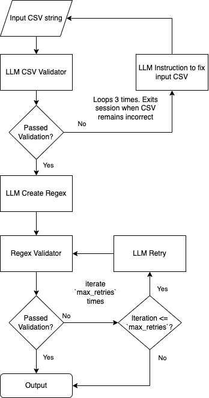

Regexer is a Python Regex pattern generator.

Curious? Try it now [here](https://regexer.streamlit.app/)!

## How it works
Under the hood, it uses LLM (OpenAI or Anthropic) to generate a Regex pattern based on a given example.



1. Input: Accepts a CSV string with only 2 headers, `base_string` and `search_string`. Where `base_string` contains the string where `search_string` must be extracted from.

2. CSV Validator: LLM will validate if the given CSV string follows the correct format. Instructions will be provided if input fails the validation.

3. LLM will create a Regex pattern based on the input CSV

4. Regex Validator: validates the Regex pattern by comparing its output against `search_string`. If for each row the Regex pattern correctly outputs the `search_string`. The program will terminate and the pattern will be displayed.

5. If Regex Validator fails, LLM will retry `max_retries` number of times until Regex Validator is passed. If `max_retries` is exhausted, the last pattern will be displayed.

## Example

Use the CSV string below as an example.
```
base_string,search_string
"https://docs.google.com/spreadsheets/d/aabc-d12/edit#gid=0","aabc-d12"
"https://docs.google.com/spreadsheets/d/33_eed/33_eed","33_eed"
```